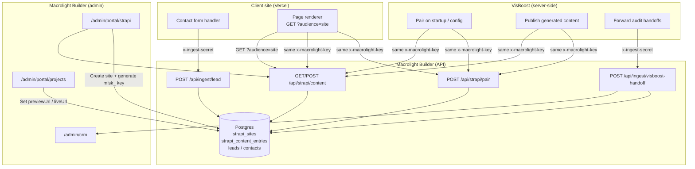
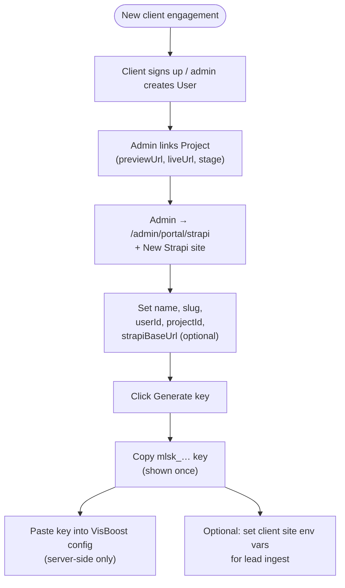
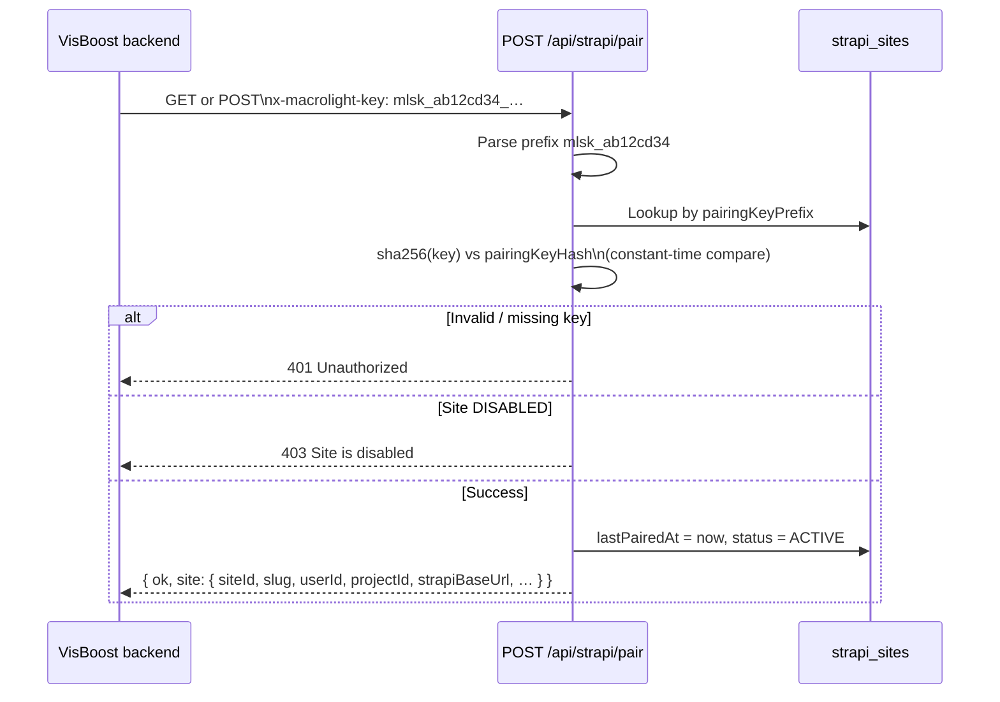
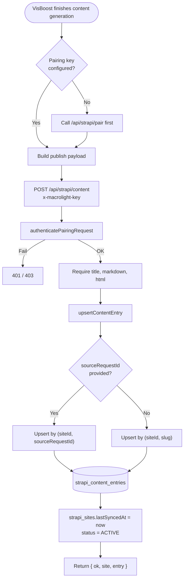
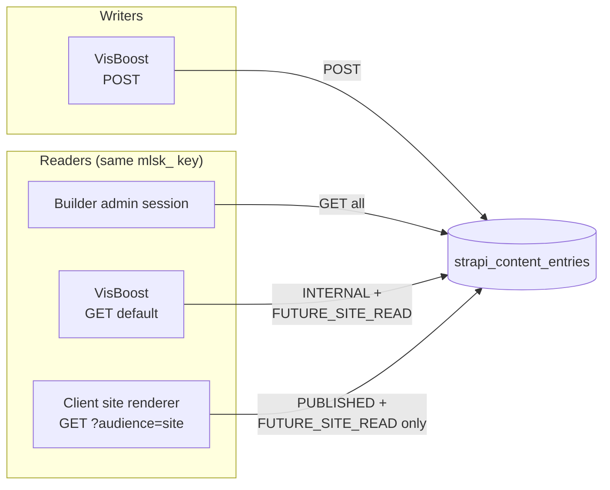
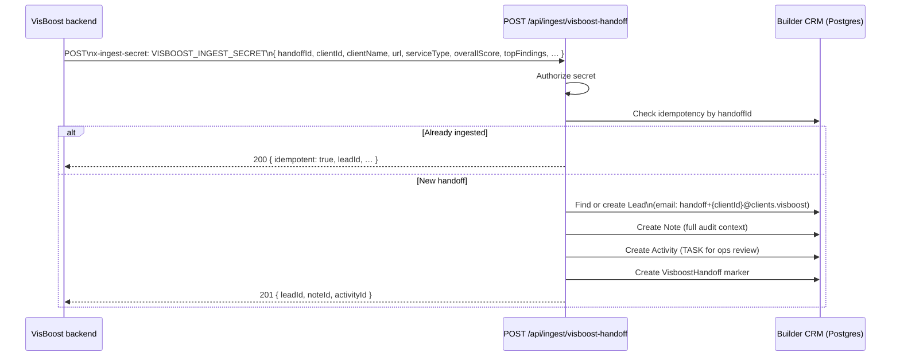
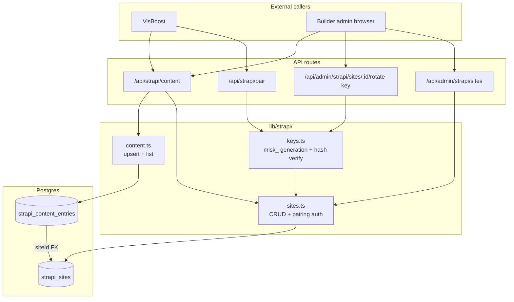
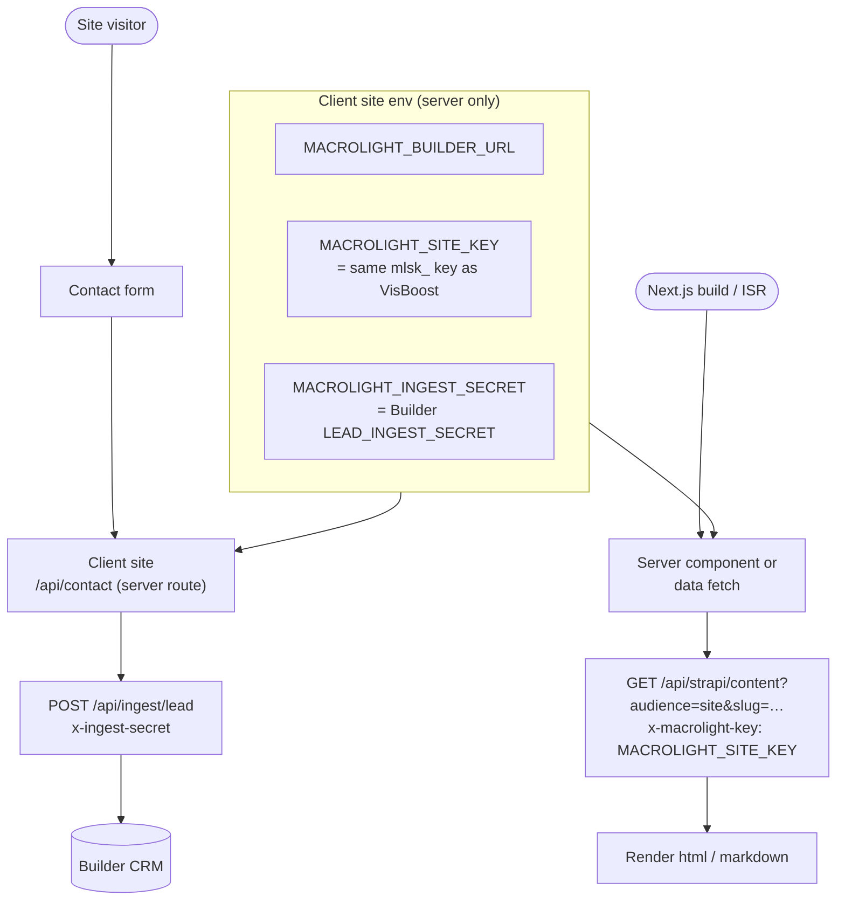
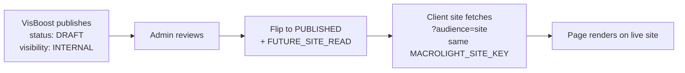
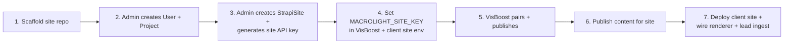

# VisBoost → Builder → Client Site Flow

How VisBoost connects to Macrolight Builder, how the Strapi content API stores and serves data, and how client sites fit in today vs. the planned build path.

**Phase 1 status (live now):** VisBoost and client site renderers share **one site API key** (`mlsk_…`). VisBoost can **pair**, **publish**, and **read** content. Client sites **read published content** via the same key (`?audience=site`) and **ingest leads** via a separate ingest secret.

---

## Actors

| Actor | Role |
| --- | --- |
| **Macrolight Builder** | Control plane — admin UI, CRM, Postgres (`strapi_sites`, `strapi_content_entries`), API routes |
| **VisBoost** | External product — runs audits, generates content, pairs to a Builder site via API key |
| **Client site** | Per-client Next.js repo deployed on Vercel — marketing site the end customer sees |
| **Builder admin** | Creates site records, generates pairing keys, reviews content in `/admin/portal/strapi` |

---

## High-level architecture



---

## 1. Admin setup — register a client site in Builder

Before VisBoost or a client site can connect, an admin creates the Builder-side records.



**What gets stored (`strapi_sites`):**

- `userId` / `projectId` — scalar links to the client's portal account and delivery project
- `slug` — stable site identifier (unique across all Builder sites)
- `pairingKeyHash` + `pairingKeyPrefix` + `pairingKeyLast4` — hashed pairing key (plaintext never stored)
- `status` — `UNLINKED` → `PENDING` → `ACTIVE` (after successful pair/publish)
- `strapiBaseUrl`, `strapiSpaceId`, `strapiCollection` — metadata for a future shared Strapi instance

---

## 2. VisBoost pairing — connect to the right Builder site

VisBoost proves it belongs to one specific client site using the Builder-issued pairing key.



**Response payload (`toPairingPayload`):** minimal site metadata VisBoost needs to scope all future calls — `siteId`, `slug`, `name`, `userId`, `projectId`, Strapi connection fields.

**Auth header options:**

- `x-macrolight-key: mlsk_…`
- `Authorization: Bearer mlsk_…`

> Server-to-server only. Never call from a browser — the key would leak.

---

## 3. VisBoost content creation — publish into Builder

VisBoost generates content (blog posts, landing copy, etc.) and pushes it into Builder's shared content layer.



### Publish payload (VisBoost → Builder)

| Field | Required | Notes |
| --- | --- | --- |
| `title` | Yes | Display title |
| `markdown` | Yes | Source markdown |
| `html` | Yes | Rendered HTML |
| `sourceProvider` | No | Defaults to `visboost` |
| `sourceRequestId` | No | VisBoost request ID — enables idempotent upsert |
| `entryType` | No | e.g. `blog_post` |
| `slug` | No | Derived from title if omitted |
| `excerpt`, `seoTitle`, `seoDescription` | No | SEO fields |
| `heroImage`, `metadata` | No | JSON blobs |
| `status` | No | `DRAFT` (default), `PUBLISHED`, `ARCHIVED` |
| `visibility` | No | `INTERNAL` (default) or `FUTURE_SITE_READ` |

### Who can read content — same key, different scopes



| Caller | Endpoint | Sees |
| --- | --- | --- |
| VisBoost | `GET /api/strapi/content` | `INTERNAL` + `FUTURE_SITE_READ` |
| Client site | `GET /api/strapi/content?audience=site` | `PUBLISHED` + `FUTURE_SITE_READ` only |
| Builder admin | `GET /api/strapi/content?siteId=…` | All entries |

---

## 4. VisBoost audit handoff — CRM path (separate from Strapi)

When VisBoost completes an audit and wants Builder ops to follow up, it uses a **different** endpoint — no pairing key involved.



**Env vars:**

- Builder: `VISBOOST_INGEST_SECRET` (falls back to `LEAD_INGEST_SECRET`)
- VisBoost: same secret as `x-ingest-secret` header

**Admin visibility:** `/admin/crm` — leads, notes, and follow-up tasks.

---

## 5. How Builder's Strapi API handles data internally

Builder is the **control plane**. It does not expose a raw Strapi admin API to client sites. Instead:



### Key design choices

1. **One site API key per site** (shared by VisBoost + client renderer). Format: `mlsk_<8-hex-prefix>_<48-hex-secret>`.
2. **Plaintext keys are never stored** — only `sha256` hash + lookup prefix.
3. **Content upsert is idempotent** — by `(siteId, sourceRequestId)` or `(siteId, slug)`.
4. **Visibility + audience gate** — VisBoost sees `INTERNAL` drafts; the client renderer (`?audience=site`) only sees `PUBLISHED` + `FUTURE_SITE_READ`.
5. **Strapi instance fields** (`strapiBaseUrl`, etc.) are metadata for a future sync worker — phase 1 stores content in Postgres, not in a remote Strapi CMS.

---

## 6. Client sites — what works today



**Also link the site operationally:**

- Admin sets `Project.previewUrl` / `Project.liveUrl` so the portal can link to the live site.
- Admin creates a `StrapiSite`, generates the site API key, and sets the same key in VisBoost + client site env.

### Content renderer example

Copy `lib/strapi/site-renderer-client.ts` into the client repo:

```ts
import { fetchSitePage } from "@/lib/macrolight/site-renderer-client";

const page = await fetchSitePage({
  builderUrl: process.env.MACROLIGHT_BUILDER_URL!,
  siteKey: process.env.MACROLIGHT_SITE_KEY!,
  slug: "about",
  revalidate: 60,
});
```

### Lead ingest payload

```json
{
  "name": "Jane Doe",
  "email": "jane@example.com",
  "phone": "555-1234",
  "company": "Acme HVAC",
  "message": "Need a quote",
  "source": "website",
  "ownerEmail": "client@example.com"
}
```

---

## 7. Publish-to-render workflow



### Build sequence for a new client site



---

## API reference (quick)

| Endpoint | Method | Auth | Caller | Purpose |
| --- | --- | --- | --- | --- |
| `/api/admin/strapi/sites` | GET/POST | Admin session | Builder admin | List/create/update site records |
| `/api/admin/strapi/sites/:id/rotate-key` | POST | Admin session | Builder admin | Generate/regenerate `mlsk_` key |
| `/api/strapi/pair` | GET/POST | `x-macrolight-key` | VisBoost | Verify key, return site metadata |
| `/api/strapi/content` | POST | `x-macrolight-key` | VisBoost | Publish/upsert content entry |
| `/api/strapi/content` | GET | Admin session or site API key | Admin / VisBoost | Read all paired entries |
| `/api/strapi/content?audience=site` | GET | Site API key | Client site renderer | Read published site-visible entries |
| `/api/ingest/visboost-handoff` | POST | `x-ingest-secret` | VisBoost | Land audit handoff in CRM |
| `/api/ingest/lead` | POST | `x-ingest-secret` | Client site | Land form submission in CRM |

---

## Environment variables

| Variable | Where | Purpose |
| --- | --- | --- |
| `LEAD_INGEST_SECRET` | Builder | Authorizes `/api/ingest/lead` |
| `VISBOOST_INGEST_SECRET` | Builder | Authorizes `/api/ingest/visboost-handoff` (falls back to lead secret) |
| `MACROLIGHT_INGEST_SECRET` | Client site | Must match Builder's `LEAD_INGEST_SECRET` |
| `MACROLIGHT_BUILDER_URL` | Client site / VisBoost | Builder base URL |
| `MACROLIGHT_SITE_KEY` (`mlsk_…`) | VisBoost + client site (server env) | One key per site from admin UI, never in browser |
| `STRAPI_BASE_URL` | Builder (optional) | Pre-fills new Strapi site records |

---

## Related docs

- [`SHARED_CONTENT_PHASE1.md`](./SHARED_CONTENT_PHASE1.md) — phase 1 content contract and read restrictions
- [`MACROLIGHT_CMS_BUILD_PLAN_v2.md`](./MACROLIGHT_CMS_BUILD_PLAN_v2.md) — full client editor + MongoDB CMS plan
- [`.env.example`](./.env.example) — Strapi + ingest secret documentation
