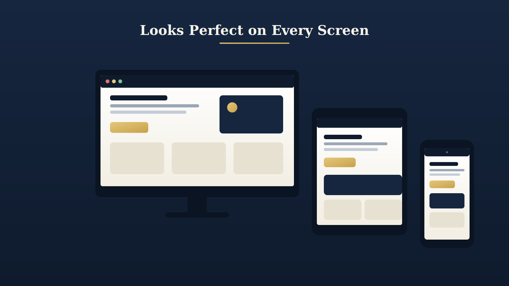
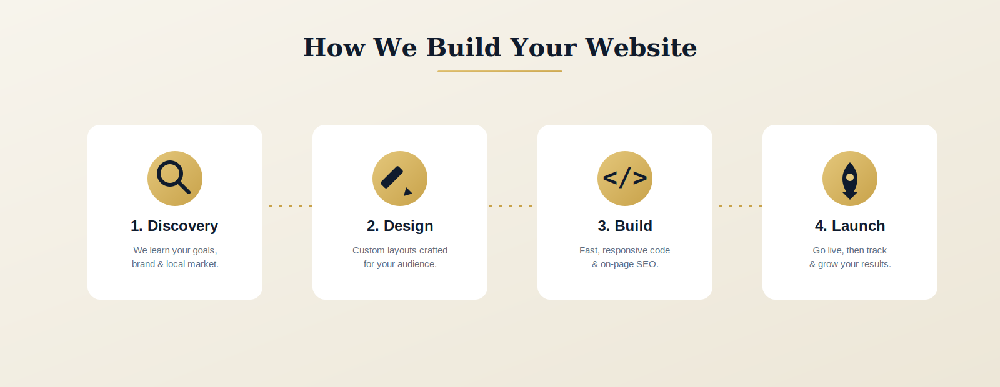
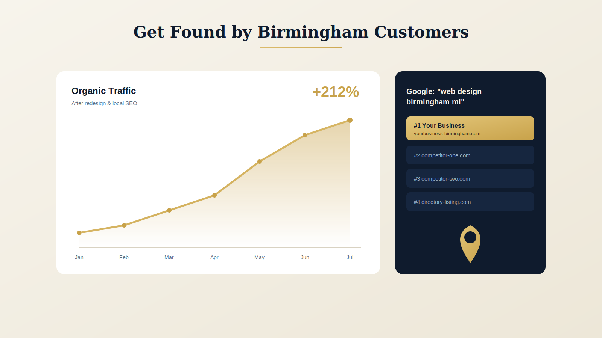

import Image from "next/image"

<Image
  src="./images/hero-birmingham-web-design.svg"
  alt="Modern custom website mockup in a browser window above the Birmingham, Michigan skyline"
  width={1600}
  height={900}
  priority
/>

# Web Design in Birmingham, MI: How to Choose a Website Builder That Grows Your Business

If you run a business in Birmingham, Michigan, your website is competing for one of the most discerning audiences in the state. Birmingham sits along the Woodward corridor in Oakland County — one of the wealthiest counties in the country — with a downtown of nearly 300 boutiques, restaurants, galleries, and professional offices serving an educated, high-income clientele. When someone in the 48009 area searches for a dentist, an attorney, a designer, or a contractor, the website they land on decides whether they call you or your competitor.

This guide walks you through everything you need to know about **web design in Birmingham, MI** — what separates a real custom website from a cookie-cutter template, what you should expect to pay, and how to choose a **Birmingham web design company** that actually moves the needle on your revenue. We build websites for Birmingham businesses every day, so we'll be candid about what works.

## Why Birmingham Businesses Need More Than a Template

It's tempting to spin up a site on a drag-and-drop **website builder** and call it done. For a weekend hobby, fine. For a business marketing to Birmingham's affluent, design-literate customers, a generic template quietly costs you money in three ways:

It looks like everyone else's. Birmingham shoppers and clients have high expectations. A template that 50,000 other businesses also use signals "small and unsure," not "established and premium."

It's slow and bloated. Most off-the-shelf builders ship heavy code that drags down load times. Google uses Core Web Vitals as a ranking factor, and visitors abandon pages that take more than a few seconds to load.

It can't be found. A pretty site that isn't built for **local SEO in Birmingham, MI** simply won't appear when nearby customers search. Ranking takes deliberate technical structure, not a theme you bought online.

A professional **web designer in Birmingham** solves all three at once: a distinctive look, fast and clean code, and a foundation built to rank locally.

## What a Great Birmingham Website Actually Includes

When we talk about **custom website design** for a Birmingham business, we mean a site engineered around how your customers actually find and choose you.

A site that earns its keep in this market has a few non-negotiables. It is fully **responsive**, looking sharp on the phones where the majority of local searches now happen. It loads fast, with optimized images and lean code. It is built for conversion, guiding visitors toward a call, a booking, or a quote rather than leaving them to wander. It has on-page SEO baked in — proper titles, headings, schema markup, and location signals so Google understands you serve Birmingham and the surrounding Oakland County communities like Bloomfield Hills, Royal Oak, and Troy. And it is genuinely yours: a design that reflects your brand, not a borrowed template.

### E-commerce and Booking, Done Right

Many Birmingham retailers and service providers need more than a brochure site. Whether you're a downtown boutique adding online ordering, a salon or spa taking bookings, or a professional firm capturing leads, the right **website builder** integrates payments, scheduling, and CRM tools cleanly — without the clutter that slows a generic platform down.

## Our Web Design Process

Good websites aren't accidents. Here's how we take a Birmingham business from idea to launch.

We start with **discovery**, learning your goals, your brand, and the local market you compete in. Then we move to **design**, crafting custom layouts built for your specific audience rather than pulled from a theme library. Next comes the **build** — fast, responsive, accessible code with on-page SEO structured in from the first line. Finally we **launch**, get you live, and keep tracking performance so the site keeps improving after go-day. You're involved at every step, and you own the result.

## How Local SEO Turns a Website Into a Lead Machine

A website that nobody finds is an expensive business card. The real return comes when your site ranks for the searches your future customers are already typing.

**Local SEO for Birmingham, MI** is about making it unmistakable to Google that you serve this area. That means optimizing your Google Business Profile, building location-specific pages, earning local citations and reviews, and structuring your site's content around the terms Birmingham customers actually search — phrases like "web design Birmingham MI," "Birmingham dentist," or "Royal Oak contractor." Pair that with fast, mobile-friendly pages and you start showing up in the local map pack and organic results where the clicks (and calls) happen.

## What Does Web Design Cost in Birmingham, MI?

Pricing varies with scope, but here's an honest range for the Birmingham market:

A focused small-business website (5–8 pages, custom design, mobile-ready, basic SEO) typically runs in the low-to-mid four figures. A larger site with e-commerce, booking, or custom functionality scales up from there based on the features you need. Ongoing care plans for hosting, updates, security, and continued SEO are usually a modest monthly investment that protects what you've built.

Be cautious of quotes that seem far too low — they often mean a recycled template, no SEO, and hidden costs later. The goal isn't the cheapest site; it's the site that pays for itself in new customers.

## Choosing the Right Web Design Company in Birmingham, Michigan

As you compare options, look for a partner who shows you real work for businesses like yours, builds on clean and maintainable technology, includes SEO rather than treating it as an upsell afterthought, communicates in plain language, and is genuinely local enough to understand the Birmingham market. Ask to see results — traffic growth, rankings, and leads — not just screenshots.

## Ready to Build a Website Birmingham Customers Notice?

Your competitors in Birmingham are investing in their online presence. A fast, beautiful, **custom website** built to rank locally is the most reliable way to win the searches that turn into customers.

We're a Birmingham-based web design studio that builds high-performance, custom websites and handles the local SEO that gets them found. If you're ready to talk about a new site — or a redesign of one that isn't pulling its weight — [get a free quote](https://www.yourstudio.com/contact) and let's map out what your project would look like.

---

## Frequently Asked Questions

**How much does a website cost in Birmingham, MI?**
A custom small-business website generally starts in the low-to-mid four figures, with e-commerce and advanced functionality costing more. Most studios also offer monthly care plans for hosting, updates, and ongoing SEO.

**How long does it take to build a custom website?**
A typical small-business site takes about four to eight weeks from discovery to launch, depending on how quickly content and feedback come together. Larger e-commerce builds take longer.

**Should I use a DIY website builder or hire a web designer in Birmingham?**
DIY builders work for very simple needs, but for a business competing in Birmingham's premium market, a professional designer delivers a faster, better-ranking, more distinctive site that converts more visitors into customers.

**Do you only work with businesses in Birmingham?**
We specialize in Birmingham but serve businesses throughout Oakland County and Metro Detroit, including Bloomfield Hills, Royal Oak, Troy, and Ferndale.

**Will my new website show up on Google?**
Yes — when it's built for it. We include on-page SEO and local optimization so your site is structured to rank for Birmingham-area searches, then we can grow those rankings over time.
